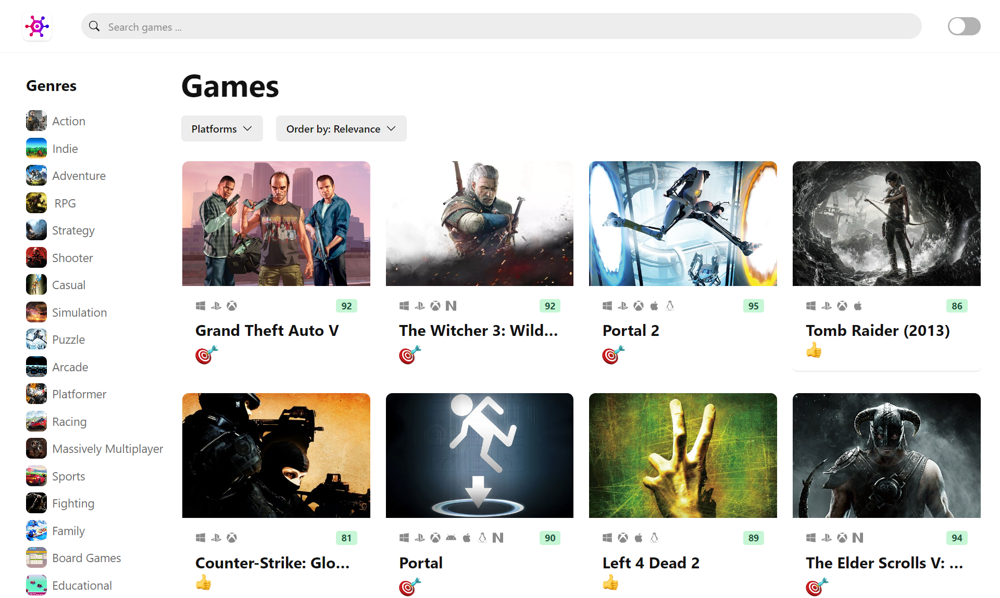

# Gamefy

Gamefy is a video game discovery web app that helps you find new and interesting games to play with the industry's most advanced JavaScript tools including React.js, Typescript, React Query, Zustand, Chakra UI, and RAWG API.

Through gamefy you can search for games by platform, genre, and more.

## Getting Started

To get started with Gamefy, follow these steps:

1. Clone this repository to your local machine.
2. Run `npm install` to install the required dependencies.
3. Get a RAWG API key at https://rawg.io/apidocs. You'll have to create an account first. 
4. Add the API key to .env file.
5. Run `npm run dev` to start the web server. 
